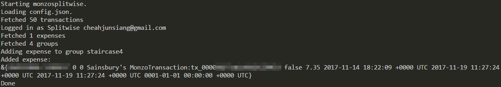

# MonzoSplitwise
Automatically adding Monzo transactions to Splitwise.

Application searches Monzo transaction history for transactions with notes that contain `#splitwise-<groupname>`. `<groupname>` corresponds to the name of a Splitwise group, minus any spaces in the name.

---

# Usage

`go run app/main.go`

Requires:

* [Monzo OAuth client details](https://developers.monzo.com/apps)
  * Currently, the app assumes that the client is a confidential client and has access to refresh tokens.
* [Splitwise OAuth client details](https://secure.splitwise.com/oauth_clients)

Copy `config.json.example` to `config.json`, and fill in the necessary details. Upon first run, the app will guide you through obtaining access tokens for both Monzo and Splitwise.